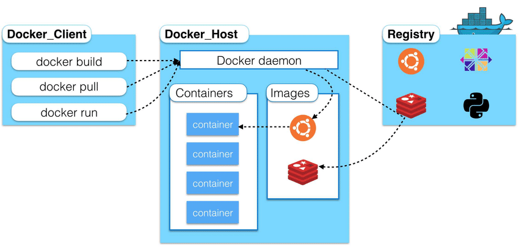
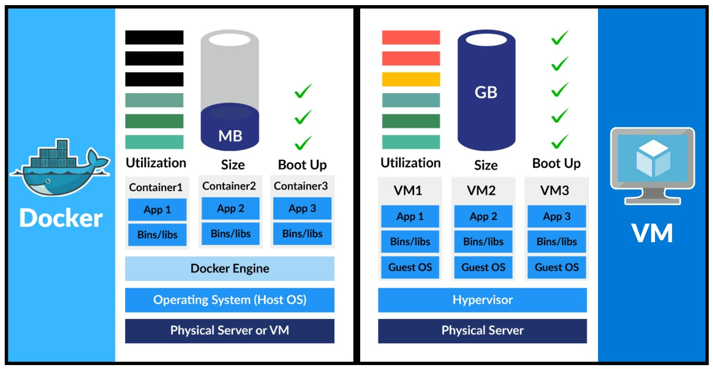
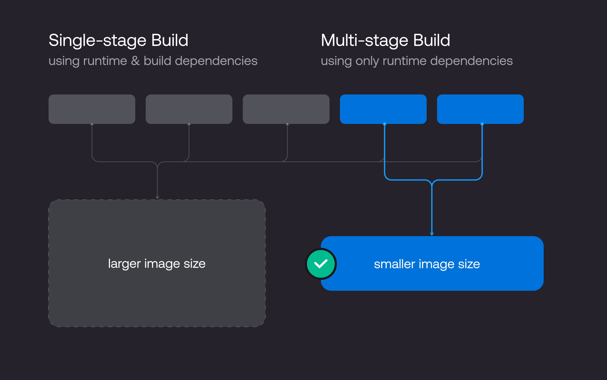
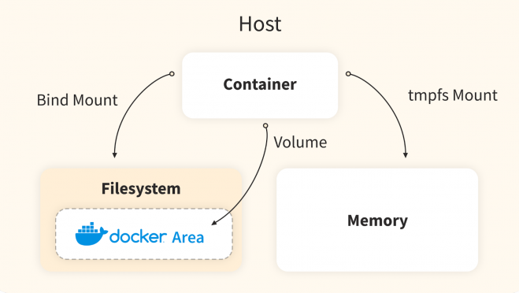
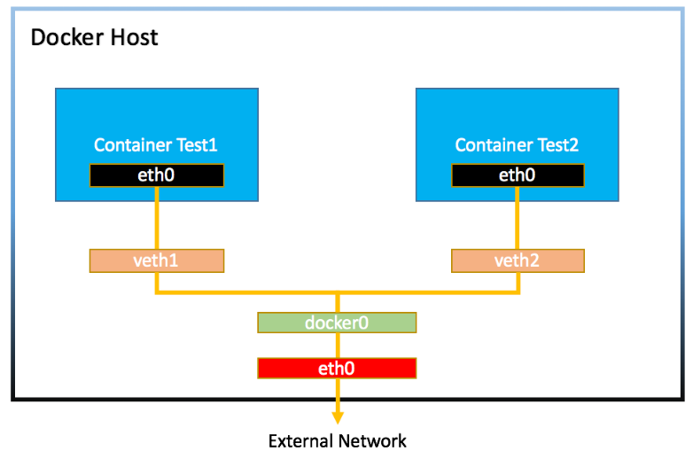

## Docker Notes

### 1.Docker
#### Docker is a containerization platform used to develop, ship, and run applications inside containers. Containers are lightweight, portable, and isolated environments that allow you to run an application with all of its dependencies bundled together. Docker ensures that your application will run the same regardless of where it's deployed, providing consistency across multiple environments.

### Key Concepts:
#### Container: A lightweight, standalone, executable package that includes everything needed to run a piece of software, including the code, runtime, libraries, and dependencies.
#### Image: A snapshot of a container. It's a read-only template that defines the container’s environment.
#### Dockerfile: A script containing a series of instructions on how to build a Docker image.
#### Docker Engine: The core component that runs containers.
#### Docker Hub: A public registry where Docker images are stored and shared

### Docker Architecture


### container 
#### A container is a standard unit of software that packages up code and all its dependencies so the application runs quickly and reliably from one computing environment to another. A Docker container image is a lightweight, standalone, executable package of software that includes everything needed to run an application: code, runtime, system tools, system libraries and settings.

#### A container is a bundle of Application, Application libraries required to run your application and the minimum system dependencies

### Docker vs Virtual Machines (VMs)
|Feature	       |Virtual Machines (VMs)	                |Docker (Containers)                                |
|------------------|----------------------------------------|---------------------------------------------------|
|Isolation	       |Full isolation, separate OS	            |Process-level isolation, shared kernel             |
|Resource Usage    |High (each VM needs full OS)            |Low (shares host OS)                               |
|Performance       |Slower due to OS overhead               |Faster due to lightweight design                   |
|Portability       |Less portable	                        |Highly portable across environments                |
|Start Time	       |Slow (full OS boot required)            |Fast (containers start instantly)                  |
|Security	       |Stronger (hardware-level isolation)	    |Weaker (shared kernel)                             |
|Management        |Complex at scale (hypervisor needed)    |Easier with tools like Docker Compose or Kubernetes|
|Use Case	       |Running multiple OSes, heavy workloads  |Microservices, CI/CD pipelines, lightweight apps   |


### Containers are light weight
#### Containers are lightweight because they use a technology called containerization, which allows them to share the host operating system's kernel and libraries, while still providing isolation for the application and its dependencies. This results in a smaller footprint compared to traditional virtual machines, as the containers do not need to include a full operating system. Additionally, Docker containers are designed to be minimal, only including what is necessary for the application to run, further reducing their size.



### 2. Core Concepts in Docker

#### Container: A container is a lightweight, standalone, and executable package that includes everything needed to run a piece of software (code, runtime, libraries, and dependencies). Containers are isolated from each other and from the host system.

#### Image: An image is a read-only template used to create containers. It includes the application code, libraries, dependencies, and the runtime needed for the container. Images are stored in a Docker registry (e.g., Docker Hub).

#### Dockerfile: A Dockerfile is a text document that contains instructions on how to build a Docker image. It specifies the base image, the necessary dependencies, and commands that should be executed to set up the container.

#### Docker Daemon: The Docker daemon (dockerd) is responsible for managing Docker containers and images. It listens for API requests and is the background service that runs on a host machine.

#### Docker Client: The Docker client (docker) is the command-line tool or API used to interact with Docker. It sends commands to the Docker daemon, such as starting, stopping, and managing containers.

#### Docker Registry: A Docker registry is a place where Docker images are stored. Docker Hub is the default public registry, but private registries can be created as well.

#### Docker Compose: Docker Compose is a tool for defining and running multi-container Docker applications. It allows you to use a docker-compose.yml file to configure the application’s services, networks, and volumes.

### Docker Desktop
#### Docker Desktop is an easy-to-install application for your Mac, Windows or Linux environment that enables you to build and share containerized applications and microservices. Docker Desktop includes the Docker daemon (dockerd), the Docker client (docker), Docker Compose, Docker Content Trust, Kubernetes, and Credential Helper. For more information, see Docker Desktop.

### 3. Advantages of Docker
#### Portability: Docker containers can run on any platform that supports Docker, making it easy to move applications between development, testing, and production environments.

#### Isolation: Each container runs in its own isolated environment, preventing conflicts between applications and making it easier to manage dependencies.

#### Consistency: Docker ensures that an application behaves the same across different environments by encapsulating all dependencies.

#### Resource Efficiency: Containers share the host OS kernel, which makes them more lightweight and faster than virtual machines (VMs).

#### Version Control and Reusability: Docker images can be versioned, making it easy to roll back or update applications. You can reuse base images to simplify configuration.

#### Scalability: Docker works well in microservices architectures and supports horizontal scaling, making it easier to manage distributed systems.

### Files and Folders in containers base images
```
/bin: contains binary executable files, such as the ls, cp, and ps commands.

/sbin: contains system binary executable files, such as the init and shutdown commands.

/etc: contains configuration files for various system services.

/lib: contains library files that are used by the binary executables.

/usr: contains user-related files and utilities, such as applications, libraries, and documentation.

/var: contains variable data, such as log files, spool files, and temporary files.

/root: is the home directory of the root user.
```
### Files and Folders that containers use from host operating system

#### The host's file system: Docker containers can access the host file system using bind mounts, which allow the container to read and write files in the host file system.

#### Networking stack: The host's networking stack is used to provide network connectivity to the container. Docker containers can be connected to the host's network directly or through a virtual network.

#### System calls: The host's kernel handles system calls from the container, which is how the container accesses the host's resources, such as CPU, memory, and I/O.

#### Namespaces: Docker containers use Linux namespaces to create isolated environments for the container's processes. Namespaces provide isolation for resources such as the file system, process ID, and network.

#### Control groups (cgroups): Docker containers use cgroups to limit and control the amount of resources, such as CPU, memory, and I/O, that a container can access.
    
### 4. How Docker Works
#### Docker works by using the host machine’s operating system to create isolated environments for containers. It uses OS-level virtualization to create these containers. Unlike virtual machines (VMs), which run a full operating system on top of a hypervisor, containers share the host system's OS kernel but run isolated processes.

#### Docker Engine: The Docker engine is the core part of Docker. It consists of three components:

#### Docker Daemon (Server)
#### Docker API
#### Docker CLI (Client)
#### Namespaces: Docker uses namespaces to provide isolation for containers. Namespaces allow processes in containers to have their own view of system resources, such as processes, network, and storage.

#### Control Groups (cgroups): Docker uses cgroups to limit the amount of resources (such as CPU, memory, and disk) available to each container, ensuring efficient resource usage.

### 5. Basic Docker Commands
#### docker --version: Check the installed Docker version.
#### docker pull <image>: Pull an image from a registry (e.g., Docker Hub).
#### docker build -t <image_name> .: Build a Docker image from a Dockerfile in the current directory.
#### docker run <image_name>: Create and start a container from an image.
#### docker ps: List running containers.
#### docker ps -a: List all containers (including stopped).
#### docker stop <container_id>: Stop a running container.
#### docker start <container_id>: Start a stopped container.
#### docker restart <container_id>: Restart a container.
#### docker exec -it <container_id> bash: Access the container’s shell for interactive commands.
#### docker rm <container_id>: Remove a container.
#### docker iamges : Verify Docker image is created.
#### docker rmi <image_name>: Remove a Docker image.

```
# Update the package repository
sudo apt update -y

# Install required packages
sudo apt install -y apt-transport-https ca-certificates curl software-properties-common

# Add Docker's official GPG key
curl -fsSL https://download.docker.com/linux/ubuntu/gpg | sudo gpg --dearmor -o /usr/share/keyrings/docker-archive-keyring.gpg

# Add Docker repository to apt sources
echo "deb [arch=amd64 signed-by=/usr/share/keyrings/docker-archive-keyring.gpg] https://download.docker.com/linux/ubuntu $(lsb_release -cs) stable" | sudo tee /etc/apt/sources.list.d/docker.list > /dev/null

# Install Docker
sudo apt update -y
sudo apt install -y docker-ce

# Start Docker service
sudo systemctl start docker

# Enable Docker to start on boot
sudo systemctl enable docker

# verify Docker Installation
docker --version

# Add your user to the Docker group (optional but recommended)
sudo usermod -aG docker $USER #ubuntu/windows

```
#### After running these commands, you may need to log out and back in (or restart the EC2 instance) for the Docker group changes to take effect

### Push Your Docker Image to Docker Hub

#### Login to Docker Hub from your EC2 instance:
```
docker login
```
#### Tag your image (replace yourusername with your Docker Hub username):
```
docker tag my-first-image yourusername/my-first-image
```
#### Push your image
```
docker push yourusername/my-first-image
```


#### A Dockerfile is a text document containing a set of instructions on how to build a Docker image. Docker images are used to create containers, which are lightweight, portable, and executable software packages that contain everything needed to run an application (including the code, libraries, environment variables, and dependencies). Dockerfiles are the blueprint for creating these images.

### Components of a Dockerfile
#### Below is a detailed explanation of common Dockerfile instructions:

### 1. FROM
#### The `FROM` instruction defines the base image for your Docker image. This is the starting point of your Docker image and dictates the environment in which your app will run.

```
FROM python:3.9-slim
```
#### In this case, the base image is the official Python 3.9 image, and `slim` indicates a smaller version of the image.

### 2. LABEL
#### The `LABEL` instruction is used to add metadata to your image, such as the author, version, or description. This can help with identification and organization.

```
LABEL maintainer="youremail@example.com"
```

### 3. RUN
#### The RUN instruction is used to execute commands during the image build process, such as installing software packages or setting up your application environment. These commands are run on top of the base image.

```
RUN apt-get update && apt-get install -y curl
```
#### This will update the package list and install `curl`.

### 4. COPY
#### The `COPY` instruction copies files or directories from your local machine (or build context) into the Docker image.

```
COPY . /app
```
#### This copies the entire contents of the current directory on your local machine to the /app directory inside the Docker image.

### 5. ADD
#### The `ADD` instruction is similar to `COPY`, but it has some additional features:

#### It can handle URLs to download files.
#### It can extract TAR archives automatically.
```
ADD https://example.com/somefile.tar.gz /app/
```
#### This will download `somefile.tar.gz` from the URL and extract it to `/app/`.

### 6. WORKDIR
#### The `WORKDIR` instruction sets the working directory for any `RUN`, `CMD`, `ENTRYPOINT`, `COPY`, and `ADD` instructions that follow it. If the directory doesn't exist, Docker will create it.

```
WORKDIR /app
```
#### This sets the working directory to `/app`.

### 7. ENV
#### The ENV instruction sets environment variables in the Docker image. These variables can be accessed later in the image or container.

```
ENV APP_ENV=production
```
#### This sets an environment variable `APP_ENV` to `production`.

### 8. EXPOSE
#### The `EXPOSE` instruction informs Docker that the container listens on the specified network ports at runtime. It doesn’t publish the port, it just documents it for people using the image.

```
EXPOSE 8080
```
#### This tells Docker that the application inside the container will listen on port 8080.

### 9. CMD
#### The `CMD` instruction specifies the default command to run when a container starts. There can only be one `CMD` in a Dockerfile. If there are multiple `CMD` instructions, only the last one will take effect.

```
CMD ["python", "app.py"]
```
#### This command will run the `app.py` file using the `python` interpreter when the container starts.

### 10. ENTRYPOINT
#### The `ENTRYPOINT` instruction defines a command that will always run when the container starts. It can be overridden by `CMD`, but if both are used together, `ENTRYPOINT` is the primary command.

```
ENTRYPOINT ["python", "app.py"]
```
#### This sets python app.py as the entrypoint of the container.

### 11. VOLUME
#### The `VOLUME` instruction creates a mount point with a specific path in the container that can be linked to a directory on the host system.
```
VOLUME ["/data"]
```
### This creates a mount point at /data inside the container.

### 12. USER
#### The `USER` instruction sets the user name or UID (user ID) to use when running the container. By default, containers run as the root user, but you can specify a non-root user for security reasons.

```
USER appuser
```

#### This makes `appuser` the user under which the container runs.

### 13. ARG
#### The `ARG` instruction defines build-time variables that can be passed to the Docker build process. They can be used to customize the build process.

```
ARG version=1.0
```

#### This defines a build-time variable version with a default value of 1.0.

### 14. SHELL
#### The `SHELL` instruction allows you to specify a custom shell to use during the execution of `RUN` instructions.

```
SHELL ["/bin/bash", "-c"]
```
#### This makes the bash shell the default shell for all RUN instructions.

### Example Dockerfile
#### Here’s an example of a Dockerfile for a Python application:
```

# Set the base image
FROM python:3.9-slim

# Set metadata
LABEL maintainer="youremail@example.com"
LABEL version="1.0"

# Set environment variable
ENV APP_ENV=production

# Create and set working directory
WORKDIR /app

# Copy local files to the container
COPY . /app

# Install dependencies
RUN pip install --no-cache-dir -r requirements.txt

# Expose port
EXPOSE 5000

# Set the default command to run the application
CMD ["python", "app.py"]

```

### How to Build and Run a Dockerfile

#### 1.Build the Docker image: Run this command in the directory where the Dockerfile is located:
```
docker build -t my-python-app .
```
#### 2.Run a container from the image: Run this command to start a container from the built image:

```
docker run -p 5000:5000 my-python-app
```
#### This will start the container, and it will be listening on port 5000


#### Difference between `CMD` & `ENTRYPOINT`
|Feature           |CMD	                                                    |ENTRYPOINT                                            |
|------------------|--------------------------------------------------------|------------------------------------------------------|
|Purpose	       |Default command to run in the container	                |Defines the main command to run                       |
|Overridable       |Yes, can be overridden by passing a different command	|Cannot be easily overridden without --entrypoint flag |
|Typical Use       |Set default command/arguments	                        |Set the main command (core process)                   |
|Syntax	           |CMD ["executable", "param1"]                            |ENTRYPOINT ["executable", "param1"]                   |


### Multi-Stage Docker Build
#### A multi-stage Docker build is a technique that allows you to create smaller, more efficient Docker images by using multiple `FROM` statements in a single Dockerfile. Each `FROM` defines a new stage in the build process, and this method is especially useful for reducing the final image size by separating the build and runtime environments.



### Key Benefits of Multi-Stage Builds:
#### Smaller Image Sizes: You can reduce the size of the final image by only copying the necessary artifacts from earlier stages, leaving behind development tools and dependencies used only for building the app.
#### Cleaner Dockerfiles: Helps in organizing and structuring the build process in a clear and maintainable manner.
#### Faster Builds: It allows the reuse of intermediate stages and layers, which can speed up the build process when only a small part of the Dockerfile changes.

#### How Multi-Stage Build Works
#### In a multi-stage Dockerfile, each stage can have its own `FROM` statement and is treated as an isolated environment for building. You define multiple `FROM` blocks in the same Dockerfile, but only the final stage is used for the final image. You can copy the necessary files from one stage to another using the `COPY --from=<stage>` command.

#### Basic Syntax
```
# Stage 1: Build Stage
FROM build-image AS build
# Install dependencies and build application
RUN install dependencies
COPY . /app
WORKDIR /app
RUN build command

# Stage 2: Final Image
FROM runtime-image
COPY --from=build /app /app
CMD ["app command"]
```

#### Here, the first stage builds the application and the second stage creates the runtime image, which only contains the necessary files for running the app, keeping it minimal.

#### Detailed Example
#### Let's break down a real-world example using a Go application.

#### 1. Stage 1: Build Stage
#### The first stage is used to build the Go binary. It uses a Golang image, installs dependencies, and builds the app.

```
# Stage 1: Build the Go binary
FROM golang:1.18 AS builder

# Set the Current Working Directory inside the container
WORKDIR /go/src/app

# Copy the Go Modules manifests
COPY go.mod go.sum ./

# Download all dependencies. Dependencies will be cached if the go.mod and go.sum files are not changed
RUN go mod download

# Copy the source code into the container
COPY . .

# Build the Go app
RUN go build -o /go/bin/app
```

#### 2. Stage 2: Final Image (Runtime Stage)
#### The second stage creates a final image for running the application. It starts with a minimal base image (e.g., `alpine`), copies the compiled binary from the builder stage, and sets the command to run the application.

```
# Stage 2: Create the runtime image
FROM alpine:latest

# Install any necessary dependencies for runtime
RUN apk --no-cache add ca-certificates

# Copy the Go binary from the builder stage
COPY --from=builder /go/bin/app /usr/local/bin/app

# Expose the port the app runs on
EXPOSE 8080

# Command to run the application
CMD ["app"]
```

#### 3. Building the Image
#### Once the multi-stage Dockerfile is ready, you can build the Docker image with the following command:

```
docker build -t my-go-app .
```

#### This command will execute the instructions in the Dockerfile, but only the final image will be used to create the container, keeping the image size small because it only contains the necessary runtime components.

#### 4. Why Multi-Stage Builds Work Well in This Case
#### Build Efficiency: The Go compiler and build tools (`golang:1.18`) are used only in the first stage to build the application and are not included in the final image.
#### Final Image Optimization: The final image is based on `alpine`, which is a much smaller image, and contains only the compiled binary (`app`) and the necessary runtime dependencies (`ca-certificates`).
#### Reduced Docker Image Size: The final image will be significantly smaller than a traditional single-stage image, which might have included unnecessary build tools, libraries, and other dependencies.

### Advanced Features of Multi-Stage Builds

#### 1. Named Stages
#### You can assign names to each stage in the Dockerfile for easier reference. This allows you to selectively copy artifacts between stages.

```
FROM node:14 AS build
WORKDIR /app
COPY . .
RUN npm install

FROM node:14-slim
WORKDIR /app
COPY --from=build /app /app
CMD ["node", "app.js"]
```
#### Here, the first stage is named `build`, and we copy files from that stage using `--from=build`.

#### 2. Using Different Base Images for Different Stages
#### Each stage can use a different base image. This is particularly useful for optimizing both the build and runtime environments.
```
# Stage 1: Build the app using a large image with build tools
FROM python:3.9 AS builder
WORKDIR /app
COPY . .
RUN pip install -r requirements.txt

# Stage 2: Create the smaller runtime image using a minimal image
FROM python:3.9-slim
WORKDIR /app
COPY --from=builder /app /app
CMD ["python", "app.py"]
```

#### In this example, `python:3.9` (a larger image) is used in the build stage, while `python:3.9-slim` (a smaller image) is used in the runtime stage.

#### 3. Minimizing Final Image Size by Using Scratch
#### If your application doesn’t require any base operating system (for example, you’re building a static binary), you can use scratch as the final base image, which is an empty image.

```
FROM golang:1.18 AS builder
WORKDIR /go/src/app
COPY . .
RUN go build -o /go/bin/app

FROM scratch
COPY --from=builder /go/bin/app /app
CMD ["/app"]
```

#### Here, the final image contains only the app binary and no OS dependencies.

#### 4. Optimizing Build Context
#### In multi-stage builds, each stage has its own set of files, which can help reduce the amount of unnecessary files being included in each stage. For instance, you might copy only the required files to the build context in each stage rather than copying the entire repository.

```
# Stage 1: Only copy the necessary files for building the app
FROM golang:1.18 AS builder
WORKDIR /app
COPY go.mod go.sum ./
RUN go mod download
COPY . .

# Stage 2: Final image with only the built binary
FROM alpine:latest
COPY --from=builder /app/myapp /bin/myapp
CMD ["/bin/myapp"]
```
### Best Practices for Multi-Stage Builds
#### 1.Keep Build and Runtime Environments Separate: Only include the necessary components (e.g., compiled binaries or minimal runtime dependencies) in the final image.

#### 2.Use Smaller Base Images for Runtime: Always use the smallest possible image for the final image, such as `alpine` or `slim` variants, to minimize the image size.

#### 3.Copy Only Necessary Files: Avoid copying unnecessary files (e.g., .`git`, `tests`, build directories) into the Docker image.

#### 4.Use Caching to Speed Up Builds: Docker caches layers to avoid redoing work. Organize your Dockerfile so that the build dependencies (like installing dependencies or building the project) happen early in the Dockerfile. This way, Docker can reuse layers if the dependencies haven't changed.

#### Multi-stage Docker builds are an excellent way to optimize your Docker images by reducing their size, making the build process cleaner, and separating concerns between building and running the application. It is especially useful in scenarios where you need a specific build environment (e.g., full SDKs, compilers, etc.) but want to keep the final image as small and secure as possible. By following best practices like using smaller base images and only copying necessary files, you can significantly improve the efficiency of your Docker images.

### Distroless Docker Image

#### A Distroless Docker image is an image that contains only the application and its dependencies, without any unnecessary additional files or a full operating system (OS). This approach minimizes the size and surface area of the image, leading to better security, performance, and maintainability. The concept of "Distroless" was introduced by Google to create minimal Docker images that focus purely on the application runtime environment.

#### The key idea is to remove everything that is not strictly necessary for running the application. This includes eliminating package managers, shells, and even standard libraries that are not needed by the application.

### Use of Distroless Images

#### 1.Security:
#### Distroless images have fewer components, which reduces the attack surface.
#### Without package managers, shells, or debugging tools, there is less opportunity for an attacker to exploit the container.

#### 2.Smaller Image Size:
#### Distroless images are significantly smaller compared to traditional Docker images. This is because they contain only the application binaries and their immediate dependencies (such as libraries), excluding the unnecessary parts of the operating system.
#### Smaller images lead to faster download times, less storage consumption, and better performance in CI/CD pipelines.

#### 3.Consistency:
#### Distroless images promote consistency across development, testing, and production environments by eliminating variations caused by different base images, OS dependencies, and tools.

#### 4.Improved Performance:
#### By reducing the image size and complexity, distroless images can lead to improved startup times and less memory consumption.

### Key Features of Distroless Images
#### 1.No Package Managers: Distroless images do not contain package managers such as `apt` (Debian/Ubuntu) or `yum` (RedHat/CentOS), which would typically allow for the installation of additional software.

#### 2.No Shell or Debugging Tools: Distroless images do not contain shells like `bash` or `sh` (which are typically used for interacting with the container). As a result, there's no way to manually execute commands inside the container.

#### 3.Minimal OS: Distroless images do not include the full operating system, only the necessary runtime dependencies for running your application.

#### 4.Explicit Dependencies: Distroless images only include the specific libraries or binaries that the application requires to run. They do not include unused or extraneous parts of the OS.

### Distroless Example
#### In traditional Dockerfiles, we often start with a full operating system image, like `ubuntu` or `alpine`, and then install the application and its dependencies. With distroless images, you go even further by using an image that is distilled to only contain the essentials.

#### Example: Python Application with Distroless
#### Standard Dockerfile Using a Full Base Image (e.g., `python`):
```
# Use an official Python image as the base image
FROM python:3.9-slim

# Set the working directory
WORKDIR /app

# Copy the local code into the container
COPY . /app

# Install any necessary dependencies
RUN pip install -r requirements.txt

# Expose the port
EXPOSE 8080

# Run the application
CMD ["python", "app.py"]
```
#### This Dockerfile uses the full Python image (`python:3.9-slim`) to build the application, which includes not only the Python runtime but also a lot of unnecessary files and libraries that are not required for production.

### 2.Distroless Dockerfile Example:
```
# Stage 1: Build the application using a full image
FROM python:3.9-slim AS builder

WORKDIR /app
COPY . /app
RUN pip install -r requirements.txt

# Stage 2: Create a minimal, distroless image for production
FROM gcr.io/distroless/python3

COPY --from=builder /app /app

# Set the command to run the application
CMD ["/app/app.py"]
```

#### Explanation of the Example:
#### 1.Stage 1 - Builder:
#### In the first stage (`builder`), we use a fuller image (`python:3.9-slim`) to install the dependencies and set up the application.
#### This allows us to install everything we need (including Python libraries and system dependencies) without worrying about the size of the final image.

#### Stage 2 - Distroless:
#### In the second stage, we switch to the Distroless Python image (gcr.io/distroless/python3), which only includes the Python runtime and libraries necessary to run the app.
#### This is the image that will be used for production, and it does not include package managers, shells, or any unnecessary binaries.

#### 3.COPY --from=builder:
#### We copy the compiled app and dependencies from the first stage to the distroless final image. The result is a clean, minimal image that contains only the Python runtime and the application itself.

#### Advantages of Using Distroless Images

#### 1.Smaller Image Sizes:
#### Distroless images are typically much smaller than traditional images because they exclude unnecessary components like package managers, shells, and unneeded libraries. This can result in images that are tens of megabytes smaller, reducing network usage, disk space, and time for deployments.

#### 2.Better Security:
#### With fewer components included in the image, the attack surface is reduced. There are no package managers (`apt`, `yum`) or shells (`bash`) that attackers can exploit to install malicious packages or execute arbitrary commands inside the container.
#### Distroless images are designed to minimize the possibility of running malicious code by providing only what’s necessary for running the application.

#### 3.Faster Deployments:
#### Smaller images mean faster download times and quicker deployments across environments, such as development, staging, and production.

#### 4.Less Maintenance:
#### You don’t need to manage or update unnecessary parts of the system. There's no need to worry about managing OS vulnerabilities, unnecessary packages, or unneeded tools.
#### Since distroless images are explicitly built for running applications, they are easier to maintain.

### Limitations of Distroless Images

#### 1.No Shell or Package Manager:
#### One of the biggest trade-offs with distroless images is that there’s no shell or package manager available. This means you cannot easily access the container to troubleshoot or modify it at runtime (e.g., using `bash` to check logs or inspect files).
#### This is especially problematic during development or when debugging issues in production.

#### 2.No Runtime Flexibility:
#### Without a shell or package manager, you cannot dynamically install additional software or troubleshoot directly inside the container. This requires developers to be more confident in the build and deployment process beforehand.

#### 3.Requires Separate Build Process:
#### In multi-stage Docker builds (common with distroless images), you need to separate the build stage from the final runtime stage. This adds an extra layer of complexity, particularly in the case of complex applications or when working with dependencies that need to be compiled.

#### 4.Not Suitable for All Applications:
#### Distroless images are perfect for simple runtime scenarios, but for applications that require complex runtime debugging or additional tools (e.g., development environments), distroless images might not be the best fit.

#### Example of distroless images:
#### `gcr.io/distroless/python3` for Python applications.
#### `gcr.io/distroless/java` for Java applications.
#### `gcr.io/distroless/nginx` for Nginx.
#### `gcr.io/distroless/base` for generic applications.

[Google Distroless github] (https://github.com/GoogleContainerTools/distroless)

#### Docker provides two primary ways to manage data persistence for containers: bind mounts and volumes. Both methods allow data to persist beyond the lifecycle of a container, but they function differently. Below are detailed notes on each, explaining the key differences, use cases, and how to work with them.



#### 1. Docker Bind Mounts : A bind mount is a way to mount a specific file or directory from the host machine into a container. The file or directory exists on the host machine, and Docker uses it directly as if it were inside the container.

### Key Characteristics:
#### Host-based paths: You specify an absolute path on the host system to mount inside the container.
#### Direct mapping: Any changes made in the mounted file or directory on the host are immediately reflected inside the container and vice versa.
#### No Docker management: Bind mounts are not managed by Docker. They depend on the host's filesystem, and Docker doesn't track their lifecycle.

#### Syntax to create a bind mount:
```
docker run -v /path/to/host/folder:/path/in/container my-container
```
#### Example:
```
docker run -v /home/user/data:/app/data my-container
```
#### In this example:
#### /home/user/data is a directory on the host machine.
#### /app/data is the directory inside the container.

#### Any changes to files in /home/user/data will be reflected in /app/data inside the container.

### Advantages of Bind Mounts:
#### Direct file access: Useful when you need to directly interact with the files on the host (e.g., for development purposes).
#### Flexible paths: You can mount any directory or file from the host to the container.

### Disadvantages of Bind Mounts:
#### No Docker management: Since bind mounts depend directly on the host filesystem, Docker cannot manage their lifecycle, and the host paths could be accidentally altered.
#### Security concerns: Bind mounts may expose the container to accidental or malicious modifications from the host system.
#### Host dependency: Bind mounts are dependent on the host's operating system. This makes them less portable than volumes.

### When to use bind mounts:
#### For development environments where you need to modify code on the host and see the changes reflected in real-time inside the container.
#### When you need access to host-specific files (e.g., configuration files) inside the container.

### 2. Docker Volumes: A volume is a more Docker-friendly method of storing persistent data. Volumes are managed by Docker and are stored outside the container’s filesystem, allowing data to persist across container restarts, rebuilds, and deletions.

### Key Characteristics:
#### Docker-managed: Volumes are fully managed by Docker. You can create, inspect, and remove them using Docker CLI commands.
#### Independent of host filesystem: Docker volumes are stored in a special directory on the host (usually /var/lib/docker/volumes/), but they are abstracted away from the host's filesystem.
#### Portability: Volumes can be easily moved between Docker hosts (using Docker's docker save and docker load or through Docker Swarm).
#### Backups: Volumes can be backed up, restored, and even shared among multiple containers.

### Syntax to create a volume:
```
docker run -v volume_name:/path/in/container my-container
```
#### Example:
```
docker run -v my_volume:/app/data my-container
```
#### In this example:

#### my_volume is a Docker volume.

#### /app/data is a directory inside the container where the volume will be mounted.

#### The volume my_volume will store data persistently, independent of the container's lifecycle.

### Advantages of Volumes:
#### Docker-managed lifecycle: Volumes are created and managed by Docker, making them easier to work with in a consistent manner.
#### Persistence across container restarts: Data stored in volumes persists even after the container is removed.
#### Isolation: Volumes are isolated from the host system's file structure, reducing security risks.
#### Easier backups and restores: Volumes can be backed up or restored separately from containers.

### Disadvantages of Volumes:
#### Less flexibility: You cannot directly access the volume files on the host unless you specifically mount them, making it harder to interact with the data unless the volume is used by a container.
#### Not as flexible as bind mounts for host interaction: If you need to access or edit files directly on the host system, volumes may not be ideal.

### When to use volumes:
#### For production environments where data persistence is essential, and you want Docker to manage storage for you.
### When you need data to persist across container rebuilds, restarts, or when you need to migrate data between containers.
#### For databases or any stateful services that require durable storage independent of the container lifecycle.

### Comparison: Bind Mounts vs Volumes
|Feature	     |Bind Mounts                               |Volumes                                                                     |
|----------------|------------------------------------------|----------------------------------------------------------------------------|
|Location      	 |Path on host machine	                    |Managed by Docker, stored in `/var/lib/docker/volumes/` (or custom location)|
|Management      |Not managed by Docker                     |Fully managed by Docker                                                     |
|Data Persistence|Persists if the host path exists	        |Persists even if the container is removed                                   |
|Security	     |Risk of exposing host system data         |Safer, isolated from the host system                                        |
|Portability     |Dependent on host filesystem and OS	    |Portable across hosts and platforms                                         |
|Backup/Restore  |Not as easy to back up	                |Easier to back up and restore                                               |
|Access	         |Can be used for direct host interaction	|Cannot be accessed directly from the host without mounting                  |
|Use case	     |Development, direct host file access  	|Production, persistent storage, databases                                   |

### Managing Volumes: Docker CLI Commands
#### Creating a volume:
```
docker volume create my_volume
```
#### Listing volumes:
```
docker volume ls
```
#### Inspecting a volume:
```
docker volume inspect my_volume
```
#### Removing a volume:
```
docker volume rm my_volume
```
#### Pruning unused volumes:
```
docker volume prune
```
### This command will remove all unused volumes, freeing up disk space.


##### Bind Mounts are more suitable when you need direct interaction with the host's filesystem, especially for development and testing.

##### Volumes are more suitable for production use, providing better data persistence, isolation, and management by Docker.

### Docker Networking
#### Docker provides a powerful way to isolate and manage applications through containers. Networking is a crucial aspect of containers, allowing them to communicate with each other and with the outside world. Docker networking enables you to define and control how containers interact with each other and with the host system. Below are detailed notes on Docker networking, including concepts, types of networks, and use cases.

### 1. Key Concepts of Docker Networking
#### Container Networks: Docker containers can communicate with each other over a network. Docker uses virtual networks to allow this interaction.

#### Network Driver: Docker uses network drivers to create and manage networks. Different drivers allow different types of network topologies and behaviors.

#### Network Namespace: Each container has its own network namespace, providing isolation. This means that each container can have its own IP address and routing table.

#### Bridge: A network bridge is a software device that allows containers to communicate with each other and with the host machine.

#### Port Mapping: Docker allows the mapping of container ports to host machine ports so that external systems can access containerized applications.

### 2. Types of Docker Networks
#### Docker supports several types of networks, each serving different use cases. The four main network drivers are:

### a. Bridge Network (default)
#### Use Case: The default network for containers when no specific network is specified.

#### How It Works:

#### When a container is run without specifying a network, it connects to the default bridge network.

#### Containers connected to the same bridge network can communicate with each other using IP addresses.

#### External traffic can be routed to containers via port mapping (host ports mapped to container ports).

#### Advantages:

#### Simplicity: It works out of the box without needing extra configuration.

#### Network Isolation: Containers can communicate with each other but are isolated from the host network.

#### Limitations:

#### It’s not suitable for large-scale, complex applications where inter-container communication needs to be fine-tuned.

### b. Host Network
#### Use Case: When containers need to share the host’s network stack directly.

#### How It Works:

#### Containers use the host's networking interface instead of having their own network namespace.

#### The container shares the host's IP address and port range.

#### This network driver allows containers to bind directly to host ports and makes the container network faster (no virtual network interface).

#### Advantages:

#### Performance: The network performance is slightly faster because there is no network translation between the container and the host.

#### Simple Communication: Useful when the container needs full access to the host’s network resources.

#### Limitations:

#### Limited Isolation: Containers using the host network are less isolated from the host system and other containers.

#### Port Conflicts: Containers can’t bind to the same port as the host.

#### c. None Network
#### Use Case: When you don’t need any networking for the container.

#### How It Works:

#### Containers connected to the none network are isolated from all networks. These containers can’t reach the external network or other containers.

#### Typically used in scenarios where containers don't require network access (e.g., for specific isolated tasks).

#### Advantages:

#### Maximum isolation from other containers and networks.

#### Limitations:

#### No networking capabilities unless explicitly configured.

#### d. Overlay Network
#### Use Case: Multi-host communication (when containers are spread across multiple hosts).

#### How It Works:

#### Containers on different Docker hosts can communicate over an overlay network by using a swarm cluster.

#### Overlay networks abstract the underlying network infrastructure, allowing containers to communicate across different physical hosts.

#### This type of network is crucial in a Docker Swarm or Kubernetes environment for orchestrated container deployments.

#### Advantages:

#### Cross-host communication: Containers can communicate seamlessly across multiple machines.

#### Easy configuration in multi-host deployments, especially for distributed systems.

#### Limitations:

#### Slightly more complex than bridge networks.

#### May introduce slight latency due to the encapsulation of traffic between hosts.

#### e. Macvlan Network
#### Use Case: When containers need to appear as physical devices on the network.

#### How It Works:

#### The container gets its own MAC address and IP address, appearing as a unique device on the physical network.

#### This can be used when containers need direct access to the network or to bypass NAT (Network Address Translation).

#### Advantages:

#### Containers appear as separate hosts on the network, making them ideal for legacy systems or when you need containers to interact with other systems as if they were independent hosts.

#### Useful in environments where networking is restricted to specific MAC addresses or IP addresses.

#### Limitations:

#### Requires extra configuration and understanding of the physical network.

#### May not be suitable for all environments (e.g., cloud-based or virtualized environments).


### 3. Docker Networking Commands
#### Here are some essential Docker commands related to networking:

#### View Networks:
```
docker network ls
```
#### Create a Network:
```
docker network create <network_name>
```
#### Inspect a Network:
```
docker network inspect <network_name>
```
#### Connect a Container to a Network:
```
docker network connect <network_name> <container_name_or_id>
```
#### Disconnect a Container from a Network:
```
docker network disconnect <network_name> <container_name_or_id>
```
### 4. Advanced Networking Features
### a. Network Aliases
#### Containers can have multiple aliases (hostnames) within a network. This is useful for easier service discovery in Docker Compose or Swarm setups.

### b. DNS Resolution
#### Docker provides an internal DNS service to allow containers to resolve each other’s names in the same network. For example, if two containers are on the same network, one container can access another using its container name as the hostname.

### c. Docker Compose Networking
#### In Docker Compose, each service (container) is automatically added to a default network, making inter-service communication easier. This feature simplifies managing multi-container applications.

#### You can also define custom networks within the `docker-compose.yml` file, controlling how containers communicate and which ones are isolated.

### 5. Use Cases for Docker Networking
#### Microservices Architecture: Containers representing different services can communicate over the same network, allowing seamless interaction.

#### Multi-host Deployments: Overlay networks allow containers on different Docker hosts to communicate, forming a distributed application or a Docker Swarm.

#### Legacy Systems: Macvlan networks can be used when legacy systems require direct access to the network via unique IP/MAC addresses.

### Security Isolation: Custom bridge networks can isolate containers that should not communicate with other services.

### 6. Best Practices for Docker Networking
#### Limit Network Access: Use custom networks to limit the number of containers that can communicate with each other.

#### Use Overlay Networks in Orchestration: In Docker Swarm or Kubernetes, use overlay networks for easy and secure cross-host communication.

#### Manage DNS Aliases: Use network aliases and environment variables for easier container communication, especially in microservices.

#### Monitor Network Traffic: Use tools like docker network inspect to monitor and debug network issues between containers.

### Docker Compose
#### Docker Compose is a tool for defining and running multi-container Docker applications. You define all of your app's services (like databases, backend, frontend, etc.) in a docker-compose.yml file, and then you can use a single command to build and start all the services.

### Benefits of Using Docker Compose
#### Multi-Container Management: You can define multiple services that are interdependent in one configuration file.
#### Easy to Scale: Docker Compose allows you to scale services up or down with a simple command.
#### Environment Configuration: You can set environment variables, build configuration, volumes, networks, and other settings for containers.
#### Reusability and Consistency: Once defined, you can easily recreate the environment across different machines or environments.
#### Isolation: It helps you isolate services in containers to avoid dependency conflicts.

### Core Concepts in Docker Compose
#### 1. docker-compose.yml File
#### This is the heart of Docker Compose. It’s a YAML file that defines the services, networks, volumes, and other configurations needed to run your application.
#### 2. Services
#### A service is simply a container in Docker Compose. Each service in a docker-compose.yml file is mapped to a Docker container.
#### 3. Networks
#### Docker Compose automatically creates a network for each project, but you can also define custom networks in the docker-compose.yml file.
#### 4. Volumes
#### Volumes are used to persist data from containers. They can be shared across services or used to store database data, logs, or configurations.

### Basic Structure of a docker-compose.yml File
#### A docker-compose.yml file typically has three key sections:
#### Version: Specifies the version of Docker Compose to use.
#### Services: Lists the containers/services that will run.
#### Volumes and Networks: Configuration for shared volumes and networks.
```
version: '3'
services:
  web:
    image: nginx
    ports:
      - "80:80"
  db:
    image: postgres
    environment:
      POSTGRES_PASSWORD: example
```

#### Version: The version of the Compose file syntax.
#### Services: Lists the containers to run (e.g., web, db).
#### Ports: Defines port mappings between the host and the container.
#### Environment: Defines environment variables like passwords.

### Docker Compose Commands
#### docker-compose up: Builds, (re)creates, and starts the services defined in the docker-compose.yml file.
`docker-compose up`

#### docker-compose down: Stops and removes the containers and networks defined in docker-compose.yml.
`docker-compose down`

#### docker-compose build: Builds images as defined in the docker-compose.yml file.
`docker-compose build`

#### docker-compose ps: Lists all running services.
`docker-compose ps`

#### docker-compose logs: Displays the logs from all containers.
`docker-compose logs`

#### docker-compose exec: Executes a command in a running service container.
`docker-compose exec web bash`


### Key Elements of docker-compose.yml
#### 1. Version
#### Defines the version of the Docker Compose file syntax to use. Common versions are 3, 3.1, 3.8, etc.
```
version: '3.8'
```
#### 2. Services
#### Defines the application services (containers). Each service can include properties such as:
#### build: Defines the build context if you want to build an image.
#### image: Specifies the image to use.
#### ports: Exposes container ports to the host.
#### volumes: Mounts directories or files from the host into the container.
#### environment: Set environment variables.
```
services:
  web:
    image: nginx
    ports:
      - "8080:80"
  db:
    image: postgres
    environment:
      POSTGRES_PASSWORD: example
```

### 3. Volumes
#### Volumes are used to persist data or share data between containers. Volumes can be declared globally or per-service.
```
volumes:
  db_data:
    driver: local
```

### 4. Networks
#### By default, Docker Compose creates a network for each project, but you can define custom networks as well.
```
networks:
  front_end:
    driver: bridge
```
### 5. Depends_on
#### The depends_on keyword expresses the dependency between services. It ensures that a service waits for another service to start before it starts.
```
services:
  web:
    image: nginx
    depends_on:
      - db
```

### Example of a Multi-Container Application
#### Here’s an example of a simple multi-container application with a web frontend and a database.
```
version: '3'
services:
  web:
    image: nginx:latest
    ports:
      - "8080:80"
    networks:
      - webnet
  db:
    image: postgres:latest
    environment:
      POSTGRES_PASSWORD: secret
    networks:
      - webnet
  redis:
    image: redis:latest
    networks:
      - webnet
networks:
  webnet:
```
#### In this example:
#### web is a frontend service running an NGINX container.
#### db is a PostgreSQL container with a password set for the database.
#### redis is a Redis container used for caching or other data storage purposes.
#### All services are connected to a custom network called webnet.

### Docker Compose in Development vs. Production
#### While Docker Compose is often used for local development environments, it can also be useful for staging or production systems. However, for production, you may need additional configurations such as:
#### Scaling: You can scale services to run more containers for load balancing.
#### Environment-specific Configurations: Use different docker-compose.override.yml files for different environments (development, staging, production).

#### Example of scaling a service:
```
docker-compose up --scale web=3
```
#### This command will scale the web service to 3 containers.

### Advanced Docker Compose Features
#### 1. Extending Docker Compose Files
#### You can extend your docker-compose.yml by using a docker-compose.override.yml file. This is useful when you want to have different configurations for development and production.


### docker-compose.override.yml
```
version: '3'
services:
  web:
    build: .
    environment:
      - NODE_ENV=development
```
#### 2. Using Build Context
#### You can build custom images for your services from a Dockerfile using the build property in the Compose file.
```
services:
  web:
    build: ./web
```
#### 3. Health Checks
#### Health checks can be added to ensure the services are running correctly. Docker Compose can wait for a service to become healthy before starting dependent services.
```
services:
  web:
    image: nginx
    healthcheck:
      test: ["CMD", "curl", "-f", "http://localhost"]
      interval: 30s
      retries: 3
```
### Best Practices
Use Named Volumes: For persistent data, use named volumes instead of bind mounts to ensure data is preserved even if containers are removed.
Use .env Files for Sensitive Data: Keep environment variables, especially sensitive data, in .env files for better security and flexibility.
##### Define Explicit Networks: Always define networks explicitly to avoid potential issues with the default bridge network.
##### Use a .dockerignore File: This prevents unnecessary files (such as .git, node_modules, etc.) from being copied into your Docker image.
##### Minimize Image Size: Use smaller base images like alpine to reduce the size of your Docker image.
##### Use Multi-stage Builds: Multi-stage builds allow you to use different images for building and running the application, reducing the final image size.
##### Keep Containers Stateless: Aim to keep containers stateless by using external storage for data persistence and separating stateful services.
##### Security: Regularly update Docker images to get the latest security patches. Avoid running containers as the root user if possible.

##### Refer Github for Examples
[Github](https://github.com/docker/awesome-compose)

