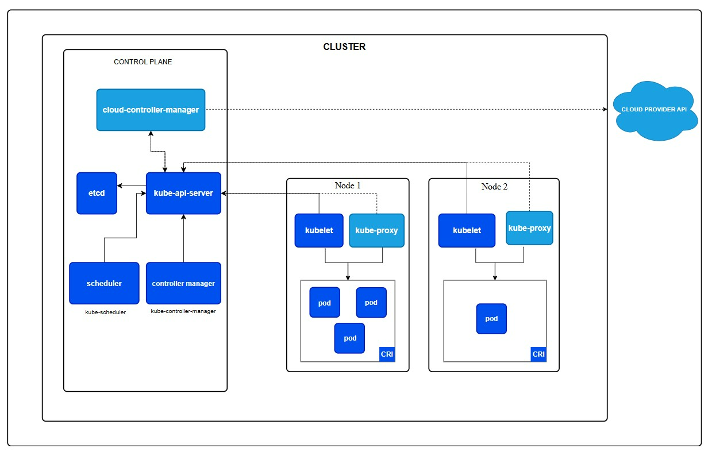

## Kubernetes

#### While Docker is a powerful tool for creating and running containers, it has some drawbacks when compared to Kubernetes (K8s), especially when scaling and managing large, complex applications. Here are the main drawbacks of Docker compared to Kubernetes:

### 1. Limited Orchestration Capabilities
#### - Docker on its own does not have advanced orchestration capabilities. It can run individual containers, but it lacks features like automated scaling, self-healing, and load balancing across a cluster of machines.
#### - Kubernetes is designed for orchestration at scale. It can automatically manage the deployment, scaling, and operation of containers across multiple machines (nodes). It also offers built-in features like automatic failover, self-healing, and rolling updates, which Docker does not provide out-of-the-box.

### 2. No Native Multi-Host Management
#### - Docker is primarily focused on managing containers on a single host. While Docker Swarm (Docker's own orchestration tool) can manage containers on multiple nodes, its capabilities are much more limited compared to Kubernetes.
#### - Kubernetes is designed from the ground up to manage containers across multiple nodes (a cluster). It provides advanced features such as service discovery, load balancing, and auto-scaling across multiple machines.

### 3. Manual Scaling
#### - Docker requires you to manually scale containers. You have to handle the creation and distribution of containers across hosts manually or with simple tools like Docker Compose, but it doesn't offer automated scaling based on load.
#### - Kubernetes provides automated scaling. With Kubernetes, you can set up Horizontal Pod Autoscalers to scale containers up or down based on demand. It can dynamically adjust resources and replicate containers across the cluster based on real-time metrics (CPU usage, memory, etc.).

### 4. Stateful Applications Handling
#### - Docker has limited native support for managing stateful applications. For example, managing databases or services that require persistent storage can be challenging.
#### - Kubernetes provides robust solutions for managing stateful applications, like StatefulSets (for managing stateful workloads), and offers persistent storage management through Persistent Volumes (PVs) and Persistent Volume Claims (PVCs), making it easier to manage state and data persistence across containers.

### 5. Self-Healing and Fault Tolerance
#### - Docker does not natively offer self-healing capabilities. If a container crashes, you would need to manually intervene to restart or replace it.
#### - Kubernetes has built-in self-healing features. If a container crashes, Kubernetes can automatically detect the failure and restart the container. It can also automatically reschedule containers on other nodes if a node fails, ensuring high availability and minimal downtime.

### 6. Complexity in Large-Scale Environments
#### - Docker becomes harder to manage at scale without proper orchestration tools. As you add more containers and hosts, managing them manually becomes cumbersome.
#### - Kubernetes is designed to manage large-scale containerized applications efficiently. It abstracts the complexity of managing a large number of containers, ensuring that scaling, deployment, and updates are handled seamlessly.

### 7. Networking Complexity
#### - Docker's networking model is simpler but can be limiting in more complex distributed systems. It can be difficult to manage network policies, service discovery, and communication between containers spread across different hosts.
#### - Kubernetes provides advanced networking capabilities, including service discovery, network policies, and ingress controllers, to manage complex inter-container communication and expose services in a more structured and secure manner.

### 8. Updates and Rollbacks
#### - Docker has basic capabilities for updating containers, but it lacks built-in features for performing zero-downtime updates or rolling back to previous versions of containers.
#### - Kubernetes provides advanced deployment strategies such as rolling updates and canary releases, allowing you to upgrade your applications without downtime. It also allows for easy rollbacks if something goes wrong.

### 9. Security and Resource Isolation
#### - Docker provides some level of isolation between containers, but Kubernetes takes it a step further with more advanced security features, such as Pod Security Policies, Network Policies, and Role-Based Access Control (RBAC).
#### - Kubernetes offers more granular control over security, resource limits (CPU, memory), and access to containers within the cluster, ensuring better security and compliance in larger, multi-tenant environments.

#### While Docker is a fantastic tool for building and running individual containers, it lacks the advanced orchestration, scalability, and fault-tolerance features that Kubernetes provides. Kubernetes is more suitable for large-scale, distributed containerized applications that need automated management, scaling, and high availability across multiple hosts or a cluster of machines. Docker can be used in small-scale environments, but as complexity and scale increase, Kubernetes offers a more comprehensive solution for managing and orchestrating containerized workloads.

#### Kubernetes (K8s) is a powerful platform for managing containerized applications and automating deployment, scaling, and operations of application containers across clusters of hosts. The architecture of Kubernetes is complex but can be broken down into its core components that work together to create a unified container orchestration system.

### Kubernetes Architecture Overview
#### At a high level, Kubernetes follows a Master-Node architecture with the master components managing the cluster, and the node components running the actual workloads (pods, containers). Kubernetes consists of the following main components:
 - Master Components (Control Plane)
 - Node Components
 

### 1. Master Components (Control Plane)
#### The Control Plane is responsible for managing the overall state of the Kubernetes cluster. The control plane makes decisions about scheduling, managing the cluster’s state, and responding to events in the cluster (e.g., deploying a new pod). The main master components include:
#### a) kube-apiserver
 - Role: The API server (`kube-apiserver`) is the central management point for all interactions in the cluster. It exposes the Kubernetes REST API, and all the cluster components communicate with each other through the API server.
 - Responsibilities:
  - Serves the Kubernetes API.
  - Handles HTTP requests from external users and internal components (like `kubectl` or controllers).
  - Validates and configures data for the API objects (e.g., pods, deployments).
  - Acts as the gateway to the entire cluster.

 - b) etcd
  - Role: `etcd` is a distributed key-value store that is used to store all of Kubernetes' configuration data, cluster state, and metadata.
  - Responsibilities:
    - Stores the configuration and state of the cluster, such as the configuration of nodes, pods, and other resources.
    - Provides strong consistency and reliability (distributed consensus).
    - Serves as the source of truth for the cluster state.
  - Note: `etcd` is a critical component for cluster availability. Losing access to etcd can cause issues with the cluster, as it cannot function without it.

 - c) kube-scheduler
   - Role: The `kube-scheduler` is responsible for selecting which node an unscheduled pod should run on, based on various scheduling policies and available resources.
   - Responsibilities:
     - Monitors the state of the cluster for unscheduled pods.
     - Uses available resources and constraints (like CPU, memory, and affinity rules) to decide where to place the pod.
     - Makes decisions based on resource requests, node selectors, taints, tolerations, etc.

 - d) kube-controller-manager
    - Role: The `kube-controller-manager` is a set of controllers that regulate the state of the cluster. It watches the state of resources and makes changes to bring the cluster to the desired state.
    - Responsibilities:
      - Node Controller: Handles node status, watches for node failures.
      - Replication Controller: Ensures the specified number of pod replicas are running.
      - Deployment Controller: Ensures deployments are running as specified.
      - Job Controller: Manages the execution of batch jobs.
      - EndPoint Controller: Ensures the correct Endpoints are associated with services.

 - e) cloud-controller-manager
   - Role: The `cloud-controller-manager` allows Kubernetes to interact with the cloud provider’s API (AWS, GCP, etc.) to manage infrastructure resources.
   - Responsibilities:
     - Manages cloud resources like load balancers, storage, and network configurations.
     - Specifically useful when running Kubernetes on cloud providers (e.g., AWS, Azure).

### 2. Node Components
#### Each node in the Kubernetes cluster runs several key components that allow it to interact with the control plane and run workloads. These node components are:

 - a) kubelet
   - Role: The `kubelet` is the primary agent that runs on each node. It ensures the containers (pods) are running as expected.
   - Responsibilities:
     - Continuously monitors the state of the node and reports back to the master (API server).
     - Manages the lifecycle of containers on the node.
     - Ensures the containers are running as per the desired state defined by the control plane (e.g., pods defined by deployments).

 - b) kube-proxy
   - Role: The `kube-proxy` manages network rules on nodes. It enables communication between pods across different nodes and ensures services are exposed properly.
   - Responsibilities:
    - Manages and routes traffic for services (load balancing).
    - Implements the Kubernetes Service concept, which helps expose pods to other pods or external traffic.
    - Supports both iptables and IPVS-based routing for load balancing.

 - c) Container Runtime
    - Role: The container runtime is responsible for running containers on the node. Kubernetes supports several container runtimes, such as Docker, containerd, or CRI-O.
    - Responsibilities:
     - Pulls container images from registries.
     - Creates and runs containers from images.
     - Reports container status to the kubelet.

### 3. Kubernetes Objects
#### Kubernetes uses a set of API objects to represent the cluster's desired state. These objects allow users to describe the system’s behavior, including how containers should be run, scaled, and connected. Some key Kubernetes objects are:

a) Pod
 - Definition: A pod is the smallest deployable unit in Kubernetes, which can contain one or more containers that share the same network namespace and storage.
 - Role: A pod is the basic execution unit that runs containers and provides the environment for running applications.

b) ReplicaSet
 - Definition: A ReplicaSet ensures that a specified number of identical pods are running at any given time.
 - Role: It ensures the desired state of the application by maintaining the required number of pods.

c) Deployment
 - Definition: A deployment provides declarative updates for pods and ReplicaSets.
 - Role: It manages updates to your application, like rolling updates and rollbacks. It allows you to specify the number of replicas of a pod.

d) Service
 - Definition: A Service is a logical abstraction that defines a set of pods and a policy by which to access them.
 - Role: It provides stable networking and load balancing to expose the pod or set of pods.

e) Namespace
 - Definition: A Namespace provides a way to divide cluster resources between multiple users.
 - Role: It helps isolate groups of resources within the same cluster (e.g., for different teams or environments).

### 4. Cluster Communication
#### Kubernetes components communicate with each other through the Kubernetes API server, typically using HTTP/HTTPS. The components like `kube-apiserver`, `kube-controller-manager`, and `kube-scheduler` make API calls to manage and monitor resources.
 - Control Plane Communication: The control plane components communicate with the `etcd` store to keep track of the cluster state.
 - Node Communication: Nodes interact with the control plane via `kubelet` and `kube-proxy` for managing pod and service state.

### 5. High Availability and Fault Tolerance
#### To ensure high availability, Kubernetes can run multiple replicas of control plane components (such as `kube-apiserver`, `kube-controller-manager`, and `kube-scheduler`) in a clustered mode. Additionally, a distributed key-value store (etcd) is also replicated across multiple nodes to ensure fault tolerance.

### 6. Key Features
#### Kubernetes offers several features to ensure that applications run efficiently and reliably:
 - Self-healing: Automatically restarts failed containers, replaces containers, kills containers that don’t respond to your user-defined health check, and doesn't advertise them to clients until they’re ready.
 - Horizontal scaling: Kubernetes can scale your applications up and down with a simple command or automatically based on resource usage (CPU, memory).
 - Load balancing: Kubernetes provides automatic load balancing for services.
 - Automated Rollouts and Rollbacks: Kubernetes can automatically roll out and roll back updates to your application, providing better release management.
 - Service Discovery: Kubernetes offers service discovery for containers, making it easier to access other pods and services within the cluster.